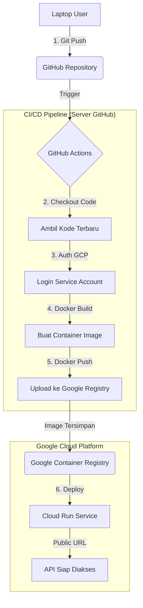

# Panduan Deployment Cloud Run (CI/CD)

Berikut adalah langkah-langkah untuk mendeploy API Prediksi Pinjaman ke Google Cloud Run secara otomatis menggunakan GitHub Actions.

## 1. Persiapan Google Cloud Platform (GCP)

1.  **Buat Project Baru** di [Google Cloud Console](https://console.cloud.google.com/).
    - Catat **Project ID** Anda (misal: `capstone-project-123`).
2.  **Aktifkan API** yang diperlukan:
    - Cari "Cloud Run API" -> Enable.
    - Cari "Artifact Registry API" -> Enable.
    - Cari "Cloud Build API" -> Enable.
3.  **Buat Service Account**:
    - Masuk ke menu **IAM & Admin** > **Service Accounts**.
    - Klik **Create Service Account**.
    - Beri nama (misal: `github-deployer`).
    - **PENTING**: Berikan Role berikut:
      - `Cloud Run Admin`
      - `Service Account User`
      - `Storage Admin` (atau Artifact Registry Writer)
      - `Cloud Build Service Account`
    - Klik **Done**.
4.  **Download Key (Kunci Akses)**:
    - Klik Service Account yang baru dibuat.
    - Masuk tab **Keys** > **Add Key** > **Create new key**.
    - Pilih **JSON**. File akan terdownload otomatis.

## 2. Persiapan GitHub Repository

1.  Push kode Anda ke GitHub (jika belum).
2.  Masuk ke Repository Anda di GitHub -> **Settings** -> **Secrets and variables** -> **Actions**.
3.  Tambahkan **New repository secret**:
    - **Name**: `GCP_PROJECT_ID`
    - **Value**: (Isi dengan Project ID Anda, misal `capstone-project-123`)
    - Klik **Add secret**.
4.  Tambahkan secret kedua:
    - **Name**: `GCP_SA_KEY`
    - **Value**: (Copy-paste **seluruh isi** file JSON yang tadi didownload)
    - Klik **Add secret**.

## 3. Proses Deployment

Setelah Secrets diatur, proses deployment akan berjalan otomatis setiap kali Anda melakukan **Push** ke branch `main`.

1.  Edit kode atau file apapun.
2.  Commit & Push:
    ```bash
    git add .
    git commit -m "Update aplikasi"
    git push origin main
    ```
3.  Cek tab **Actions** di GitHub. Anda akan melihat workflow "Deploy to Cloud Run" sedang berjalan.
4.  Jika sukses, klik workflow tersebut -> klik step **Show Output** atau bagian Deploy. Anda akan mendapatkan URL publik, contohnya:
    `https://loan-prediction-api-xyz-uc.a.run.app`

## 4. Cara Menggunakan API (Setelah Deploy)

API Anda siap digunakan dengan 3 endpoint berikut:

- **Logistic Regression**:
  `POST https://<URL-ANDA>/predict/logistic`
- **Random Forest**:
  `POST https://<URL-ANDA>/predict/random-forest`
- **XGBoost**:
  `POST https://<URL-ANDA>/predict/xgboost`

**Contoh Body JSON**:

```json
{
  "pendidikan": "Graduate",
  "wirausaha": "No",
  "jumlah_tanggungan": 2,
  "pendapatan_tahunan": 5000000,
  "jumlah_pinjaman": 150000000,
  "jangka_waktu_pinjaman": 360,
  "skor_kredit": 1,
  "aset_rumah": 500000000,
  "aset_usaha": 0,
  "aset_mewah": 50000000,
  "aset_bank": 100000000
}
```

## 5. Alur Kerja CI/CD (Pipeline Flow)

Berikut adalah diagram bagaimana kode Anda berjalan dari Laptop sampai ke Google Cloud Run secara otomatis:



**Penjelasan Tahapan:**

1.  **Git Push**: Anda mengirim perubahan kode ke GitHub (`git push`).
2.  **Trigger**: GitHub melihat ada perubahan di branch `main`, lalu membangunkan robot "Action".
3.  **Auth (Otentikasi)**: Robot login ke Google Cloud menggunakan "Kunci Rahasia" (`GCP_SA_KEY`) yang Anda simpan di Settings.
4.  **Build**: Robot membungkus aplikasi Flask Anda menjadi "paket" (Docker Container) yang berisi kode + semua library (pandas, xgboost, dll).
5.  **Push Image**: Paket tersebut dikirim (upload) ke gudang penyimpanan Google (Container Registry).
6.  **Deploy**: Robot memerintahkan Cloud Run: _"Ambil paket terbaru dari gudang, lalu jalankan!"_.
7.  **Selesai**: Cloud Run memberikan URL baru dimana API Anda hidup.
