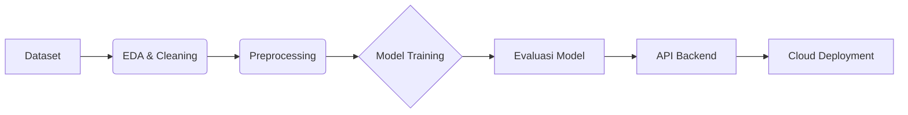

# 🏦 Smart Credit AI: Sistem Klasifikasi Kelayakan Kredit


> **Proyek Capstone** untuk membangun sistem cerdas yang dapat memprediksi kelayakan pengajuan pinjaman kredit nasabah berdasarkan data profil finansial mereka.

---

## 📋 Daftar Isi

1. [Tentang Proyek](#-tentang-proyek)
2. [Alur Kerja (Pipeline)](#-alur-kerja)
3. [Exploratory Data Analysis (EDA)](#-1-exploratory-data-analysis-eda)
4. [Data Preprocessing](#-2-data-preprocessing)
5. [Pengembangan Model](#-3-pengembangan-model)
6. [Deployment & Cloud](#-4-deployment--cloud)
7. [Dokumentasi API](#-5-dokumentasi-api)
8. [Cara Menjalankan Lokal](#-6-cara-menjalankan-lokal)

---

## 📖 Tentang Proyek

Lembaga keuangan sering menghadapi tantangan dalam menentukan apakah seorang pemohon pinjaman layak diberikan kredit atau tidak. Keputusan yang salah dapat berakibat pada kredit macet (NPL) atau hilangnya potensi nasabah baik.

**Smart Credit AI** hadir sebagai solusi berbasis Machine Learning untuk mengotomatisasi proses persetujuan pinjaman dengan menganalisis berbagai faktor seperti:

- Skor Kredit (CIBIL Score)
- Pendapatan & Aset
- Jumlah & Jangka Waktu Pinjaman
- Status Pendidikan & Pekerjaan

---

## 🔄 Alur Kerja

Proyek ini mengikuti siklus _end-to-end Machine Learning_:



1.  **Data Collection**: Mengumpulkan data historis pinjaman.
2.  **EDA**: Menganalisis pola dan korelasi data.
3.  **Preprocessing**: Membersihkan dan transformasi data agar siap untuk mesin.
4.  **Modeling**: Melatih algoritma Logistic Regression, Random Forest, dan XGBoost.
5.  **Deployment**: Mengemas model menjadi API menggunakan Flask dan deploy ke Google Cloud Run.

---

## 🔍 1. Exploratory Data Analysis (EDA)

Kami melakukan analisis mendalam untuk memahami karakteristik data.

**Temuan Utama:**

- **Keseimbangan Data**: Dataset cukup seimbang dengan proporsi **62% Disetujui** dan **38% Ditolak**.
- **Faktor Penentu Utama**: `cibil_score` (Skor Kredit) memiliki korelasi terkuat dengan status persetujuan. Skor yang rendah hampir pasti ditolak.
- **Hubungan Pendapatan & Aset**: Terdapat korelasi linear yang sangat kuat antara pendapatan tahunan dengan nilai aset (rumah, komersial, mewah, bank). Semakin tinggi pendapatan, semakin banyak aset yang dimiliki.

---

## ⚙️ 2. Data Preprocessing

Sebelum masuk ke tahap modeling, data mentah diproses terlebih dahulu:

1.  **Pembersihan Data**: Menghapus spasi berlebih pada kolom dan nilai kategorikal.
2.  **Feature Selection**: Membuang kolom `loan_id` karena tidak relevan untuk prediksi.
3.  **Encoding**: Mengubah data teks menjadi angka.
    - `education` (Graduate/Not Graduate) $\rightarrow$ 0/1
    - `self_employed` (Yes/No) $\rightarrow$ 0/1
4.  **Scaling**: Menggunakan **StandardScaler** untuk menyetarakan rentang nilai pada fitur numerik (seperti pendapatan dan jumlah pinjaman) agar model lebih optimal.

---

## 🧠 3. Pengembangan Model

Kami bereksperimen dengan tiga algoritma berbeda untuk mencari performa terbaik:

| Model                   | Akurasi     | Keterangan                                                                     |
| :---------------------- | :---------- | :----------------------------------------------------------------------------- |
| **Logistic Regression** | ~92.27%     | Baseline model, baik namun kurang menangkap pola kompleks.                     |
| **XGBoost Classifier**  | ~97.89%     | Performa sangat tinggi dengan boosting.                                        |
| **Random Forest**       | **~98.36%** | **Model Terbaik (Champion)**. Dipilih karena akurasi dan stabilitas tertinggi. |

Model **Random Forest** akhirnya dipilih dan disimpan (`random_forest_model.pkl`) untuk digunakan di sistem produksi.

---

## ☁️ 4. Deployment & Cloud

Sistem ini dideploy menggunakan arsitektur **Serverless** modern untuk skalabilitas dan kemudahan maintenance.

- **Platform**: [Google Cloud Run](https://cloud.google.com/run)
- **Container**: Docker
- **CI/CD**: GitHub Actions

**Otomatisasi**:
Setiap kali ada perubahan kode (push) ke branch `main`, GitHub Actions akan otomatis:

1.  Membangun (Build) Docker Image baru.
2.  Mengirim (Push) image ke Google Artifact Registry.
3.  Mendeploy revisi terbaru ke Cloud Run secara live.

---

## 🔌 5. Dokumentasi API

Anda dapat mengakses layanan prediksi melalui REST API berikut:

### Endpoint Prediksi

- **URL**: `[URL_CLOUD_RUN_ANDA]/predict/random-forest`
- **Method**: `POST`
- **Content-Type**: `application/json`

### Contoh Request Body

Kirim data parameter pemohon dalam format JSON:

```json
{
  "jumlah_tanggungan": 2,
  "pendidikan": "Graduate",
  "wirausaha": "No",
  "pendapatan_tahunan": 9600000,
  "jumlah_pinjaman": 29900000,
  "jangka_waktu_pinjaman": 12,
  "skor_kredit": 778,
  "aset_rumah": 2400000,
  "aset_komersial": 17600000,
  "aset_mewah": 22700000,
  "aset_bank": 8000000
}
```

### Contoh Response

API akan mengembalikan keputusan apakah pinjaman disetujui atau ditolak, beserta tingkat keyakinannya.

```json
{
  "model": "random-forest",
  "status": "Disetujui",
  "prediction_label": 0,
  "confidence": "98.50%",
  "ratio_aset_pinjaman": "1.69x"
}
```

> **Catatan**: Jika status ditolak namun rasio aset terhadap pinjaman sangat besar (>5x), sistem memiliki aturan hibrida untuk memberikan status "Disetujui Bersyarat".

---

## 💻 6. Cara Menjalankan Lokal

Jika Anda ingin menjalankan proyek ini di komputer Anda sendiri:

1.  **Clone Repository**

    ```bash
    git clone https://github.com/username/project-repo.git
    cd project-repo
    ```

2.  **Install Dependencies**
    Pastikan Python sudah terinstall, lalu jalankan:

    ```bash
    pip install -r cloud_api/requirements.txt
    ```

3.  **Jalankan Aplikasi**

    ```bash
    python cloud_api/main.py
    ```

4.  **Akses API**
    Server akan berjalan di `http://localhost:8080`.

---

_Dibuat dengan ❤️ oleh Tim Capstone Smart Credit AI_
